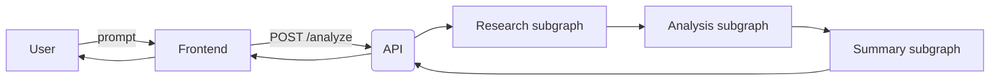
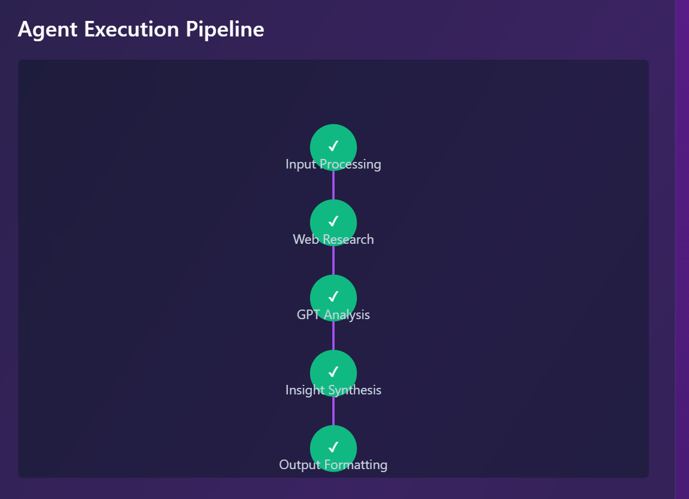

# Full-Stack Marketing.MBA LangGraph Agent using FastAPI and React

## 1. Overview 

This repository contains a LangGraph-based AI agent for performing a marketing orchestration workflow:

- `Input- natural language prompt`:
"Analyze current market trends for AI-powered design tools and generate 3 positioning insights with supporting data."

- `External data`: SerpAPI and Google Gemini 2.5-flash

- `Subgraphs` (explicit state & transition nodes): research → analysis → summary/insights

- `Response:` : structured JSON with `insights` (n numbers>=3), `sources`, and `thought_trace` (short reasoning steps)


## 2. Demo 


## 3. Architecture
### 3.1 Architecture: Full-Stack System Architecture

Mermaid flow:




#### 3.1.1 How it works (end-to-end)

1. Frontend (React) sends POST `/analyze` with a natural language prompt.

2. FastAPI backend receives the prompt and runs the `LangGraphAgent`.

3. Agent performs three subgraphs (explicit state):
   - **research**: call SerpAPI and produce `raw_results` + `sources`.
   - **analysis**: call Google Gemini 2.5-flash API and prduce LLM output - `insights`.
   - **summary**: map signals to 3 concise insights; produce `thought_trace`.

4. Backend returns structured JSON with `insights`, `sources`, `thought_trace`, and `raw_research`.

5. Frontend displays results.


### 3.2 Architecture: Agent Architecture

Multi-Agent Horizontal (Linear) Unidirectional Architecture



Some major takeaways:
- Each node operates on the Shared State model.
- The graph enforces deterministic execution in linear and forwarding order.


#### 3.2.1 Agent Nodes & responsibilities
 **Input Processing (root):** 
 - Receives validated input from user, orchestrates subgraphs, maintains explicit `state` dict and `thought_trace`. Handles concurrency control for external calls.

**Web Research subgraph (ReserachNode):**
- Node: Query generator, Parallel search workers (bounded concurrency), Raw results aggregator.
- Output: `raw_results` (list of search hits).

**GPT Analysis subgraph (AnalysisNode):**
- Node: Candidate extractor (LLM), Scorer, Deduplicator / Selector, Source linker.
- Output: `candidate_points`, `point_scores`, `selected_points`.

**Insight Synthesis/ Summary subgraph (SummaryNode):**
- Node: Formatter (insights), Confidence estimator, packaging outputs.		- Output: final `insights`, `sources`, `thought_trace`, `confidence_score`

**Output:**
- Displays output on the UI


#### 3.2.2 Agent State schema (explicit)
`state` is a nested dict recorded across subgraphs:
```json
{
  "input": { "prompt": "...", "max_results": ... },
  "research": { "queries": [...], "raw_results": [...] },
  "analysis": { "candidate_points": [...], "point_scores": [...] },
  "summary": { "insights": [...], "sources": [...] }
}
```


## 4. Design Choices & Trade-offs

**a.**	`Architecture`: For agent, a simple linear horizontal architecture suits the purpose as the requirement is pretty straightforward with no backward dependencies. 

Full-stack microservice architecture was preferred for the end-end development as this gives flexibility for debugging and easier to implement. I focus on full-stack AI also because, it gives me control on the complete product.

Used separate React components for listing sources, making summarization, and loading spinners.

- `Trade-off`: As of now, the architectural choices are standard and industry-ready. With scaling, we can go for hybrid or vertical architecture for agents. 

**b.**	`APIs`: SerpAPI for Real-world data from web search results and Google Gemini 2.5-flash API for LLM that summarizes insights based on the search results were preferred.

External requests are async and capped (bounded concurrency) to avoid overloading API or hitting rate limits.

- `Trade-off`: Both are freemium. We can use paid APIs for an extended time period and more polished output.

**c.**	`Explicit subgraphs` (Research/Analysis/Summary): Help visibility into intermediate state and debugging. Mirrors how LangGraph splits concerns and progresses between agents enabling transparency & debugging; each subgraph writes into state.

- `Trade-off`: bigger payload and more surface area to manage; mitigated by concise, purposeful logging user Python Logger.

**d.**	`Modular subgraphs`: Separate responsibilities (research/analysis/summary) → easier to replace components

- `Trade-off`: overhead of interfaces between subgraphs.

**e.**	`Reasoning visibility`: thought_trace captures high-level decisions (e.g., query formation, failures, selection), makes it easier to trace where the possible issues lie, if any. 

State captures raw inputs/outputs per subgraph — this is critical for auditability & for later storing as memory. 

- `Trade-off`: As of now, the reasoning is fine for this use case.

**f.**	`Error handling & resilience`: Graceful fallback to mock sources if external calls fail.

- `Trade-off`: Incorporated exception-handling and with extended edge cases it can be matured. 


## 5. Strong Aspects : Full-Stack Multi-Agent Marketing Intelligence

- **a.** `Production-grade Full-Stack Code`: modular, clean and reusable code. Attention was given to address exceptions gracefully.

Full-stack development (end-to-end) has been carried out maintaining high caliber, enthusiasm and standard.

- **b.** `Test Scripts`: includes test scripts with detailed edge cases for API (Gemini)

- **c.** `External API integrated`: For web research and LLM result generation, official APIs have been used. Users will experience a genuine and real-time data with richer summarization and confidence calibration.

- **d.** `Industry Standard Maintained`: Sufficient exception handling considering the use case, full-stack development with visually appealing UI.

- **e.** `Security & Best Practices Maintained`: Secrets via environment variables (.env) for dev environment (recommended advanced secrets manager), and input validation with Pydantic (AgentInput) have been maintained.
Timeouts and retries on external calls (tenacity), and minimal CORS configuration have been enabled (recommended OAuth (JWT/API key) for production).


## 6. Scope of improvement for production : Possible Extension

**a.** `DataBase, Memory Storage & Caching Integration:`
- yes, cache results from APIs for repeated prompts can be used in DB.
- persisted agent state or a vector DB for long-term memory can be used.
- Rate limiting can be used.
-  Persist state and thought_trace to a DB (Postgres) or vector DB for later recall and personalization can further be used.
- Redis could have been used here, but it comes with 30 MB storage and Render DB is free for one month.

**b.** `Parallelization and event-driven orchestration:`
- Fetch SerpAPI along with other news/data sources in parallel (fetch multiple APIs for a single agent).
- Run analysis pipelines concurrently for multiple signals.
- Use a task queue (Celery/RQ) or serverless functions to scale heavy tasks, and return job IDs for long-running runs.

**c.** `Robustness & error handling:`
- Retry/backoff for external calls, timeouts, partial success handling.
- Input validation, rate-limiting and quotas, observability (tracing, metrics).

**d.** `Virtualization and Containerization:`
- Integration of CI/CD pipelines and virtualizion using Docker and Kubernetes could have been implemented. 

**f.** `Robust deduplication & clustering:`
- Use semantic embeddings + clustering to merge similar insights.

**g.** `Extended Security & infra`
- Add JWT / OAuth2 authentication for user-level access and per-user quotas. 
- Rate-limiting, monitoring (Prometheus), structured logging, extended error tracking (Sentry).
- Use secrets manager (AWS Secrets Manager / HashiCorp Vault) for SerpAPI and Google Gemini API keys instead of .env for development
- Dependency safety by keeping dependencies pinned and run vulnerability scans (Snyk/bandit).

**h.** `Extended Testing with More Edge Cases:`
- Unit tests for orchestrator logic, integration tests that mock SerpAPI and Google Gemini API, end-to-end tests (Playwright) for UI.

**i.** `Advanced Observability:`
- Add tracing (OpenTelemetry) across service calls and subgraph transitions.

**j.** `Possible Feature Extension`
- PDF extractor
- Secure sign-in to use the platform for limiting unauthorized access
- Save previous prompts and enable auto-suggestions


## 7. Tools & Software Used

- Tools Used:

[](https://skillicons.dev)


- Cloud and software used:

1. [Render Account](https://render.com/)
2. [VS Code IDE](https://code.visualstudio.com/)
3. [GitHub](https://github.com/NavidBinAhmed/)
4. [Mermaid](https://www.mermaidchart.com/)
5. Virtual/AI Assitants (claude, chatGPT, YouTube)


### 7.1 Usefulness of AI Assistants: Speed, Modernization, and Reliability

- Quick error handling and finding solution. Multiple solutions are provided from which the most acceptable solution was applied for a robust and fastest development

- Check for security vulnerabilities. SQL injection and other threats may occur and so a thorough security analysis was done based on the best practices and advanced tentative solutions. However, most of which is associated to ‘further extension’, in a later section

- Embracing what is out of idea. Learning is life-long. AI Assistants help gain a speedy learning curve easily, to the point, and on-the-go. Better than boring video tutorials or books.

-  `Example prompt 1`: while working with a paid old OpenAI API
I use paid openai api which is no longer accessible. Kindly share alternative free apis that should work.

-  `Example prompt 2`: while interfacing and validating output on the React UI
In FastAPI Full Stack project, one API associated with research agent works fine. But another agent’s output - analysis marketing insights/summary associated with another OpenAI API is missing. Suggest what causes the issue and recommend solution?


### 7.2 Reasons for Choosing Specific AI Assistants

- `ChatGPT`: easier to access, has a freemium version. Useful for everyday use-cases. I love it because it knows about me more than that I do. (Laughing out loud) 

- `Claude.AI`: Better for software dev, as it illustrates a solution graphically. Easier to catch the underlying concepts on Claude. But very limited access in freemium version.

- `Other Tools/Sites`: Google is the best friend! Search results came up with the personalized solutions in AI mode version.


## 8. Run the Project Locally

`clone the repo:`

```
git clone https://github.com/NavidBinAhmed/AI-agent-marketing.git
```

`Backend:`

```
cd backend
```

```
python -m venv mmba && source .mmba/source/activate
```

```
pip install -r requirements.txt
```

```
uvicorn app.main:app --reload (open http://localhost:8000)
```

`Frontend:`

```
cd frontend
```

```
npm install
```

```
npm run dev (open http://localhost:3000)
```


## 9. Issues Encountered: Trial & Error

- Tailwind CSS setup: upgraded from v3 to v4
- API integration: Switched to Gemini from OpenAI
- Insights generation issue 
 - Sources listing issue, 
and more 


## 10. Documentation (click below to view)


```copyright@2025, Marketing.MBA```
```Dev: Navid Bin Ahmed```